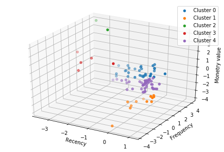

# Customer-Segmentation
Customer segmentation is the process of dividing coustomer of any company into different groups where coustoumer of each group tends to have similar characteristics.

# RFM-analysis

RFM (recency, frequency, monetary) analysis is a marketing technique used to understand customer by examining how recently a customer has purchased (recency), how often they purchase (frequency), and how much the customer spends (monetary).
# Objective
<ul>
  <li>Maximize the value of each customer to the business and increase sales.</li>
  <li>Understand the customers needs and patterns.</li>
</ul>

<h3>Customers were divided into 5 cluster based on elbow method and Silhouette Coefficient Score.</h3> 
</img>
<b>
  Cluster 0=For some time they haven't transacted and had average frequency. 
  Cluster 1=It’s been a long time they haven't transacted and used to transact less. 
  Cluster 2=They transacted recently, do so often and spend more than other customers. 
  Cluster 3=They transacted recently,and have average frequency. 
  Cluster 4=It’s been a long time they haven't transacted but had average frequency.
 </b>
  
